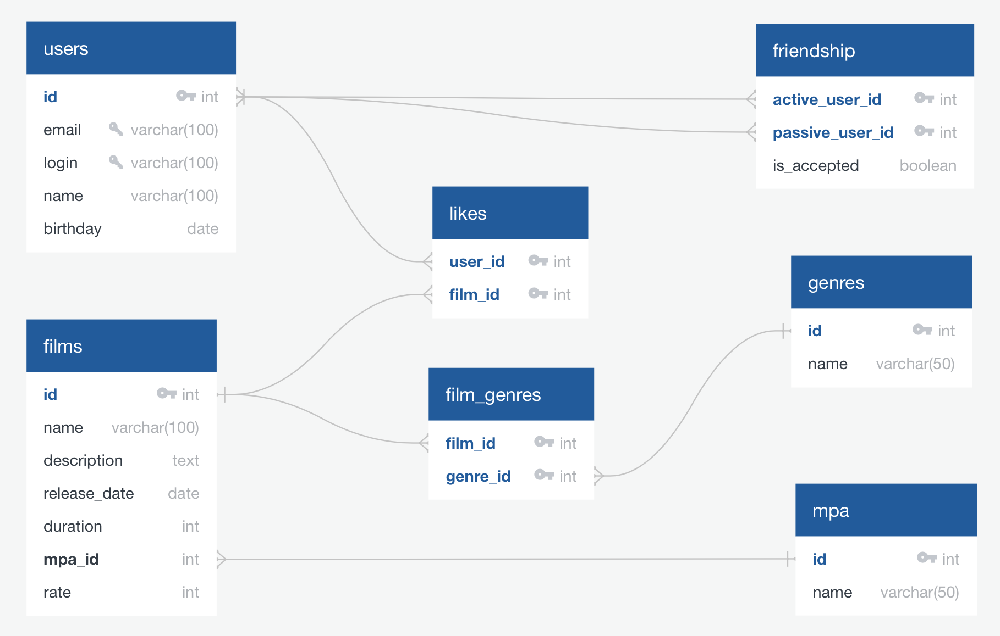

# Диаграмма БД:



__*Примеры запросов*:__
1. *Выбрать [N] самых популярных фильмов.*
``` sql
SELECT f.id, f.NAME, COUNT(*)
  FROM films AS f
  LEFT JOIN likes AS l ON f.id = l.film_id
  GROUP BY f.name
  ORDER BY
    CASE WHEN l.film_id IS NULL THEN 1 ELSE 0 END,
    COUNT(*) DESC
  LIMIT [N];
```
2. *Вывести список общих друзей пользователей с [id1] и [id2]. Дружба односторонняя (как "подписчики" в instagram).*
``` sql
(
-- друзья пользователя [id1], которым он сам отправил заявку
SELECT u2.id, u2.name
  FROM users AS u1
  JOIN friendship AS f1 ON u1.id = f1.active_user_id
  JOIN users AS u2 ON u2.id = f1.passive_user_id
  WHERE u1.id = [id1] AND is_accepted = true

UNION

-- друзья пользователя [id1], заявку от которых он получил
SELECT u2.id, u2.name
  FROM users AS u1
  JOIN friendship AS f1 ON u1.id = f1.passive_user_id
  JOIN users AS u2 ON u2.id = f1.active_user_id
  WHERE u1.id = [id1]
)

INTERSECT

(
-- друзья пользователя [id2], которым он сам отправил заявку
SELECT u2.id, u2.name
  FROM users AS u1
  JOIN friendship AS f1 ON u1.id = f1.active_user_id
  JOIN users AS u2 ON u2.id = f1.passive_user_id
  WHERE u1.id = [id2] AND is_accepted = true

UNION

-- друзья пользователя [id2], заявку от которых он получил
SELECT u2.id, u2.name
  FROM users AS u1
  JOIN friendship AS f1 ON u1.id = f1.passive_user_id
  JOIN users AS u2 ON u2.id = f1.active_user_id
  WHERE u1.id = [id2]
);
```
3. *Вывести любимые жанры пользователя [id1].*
``` sql
SELECT g.name, COUNT(*)
  FROM films AS f
  JOIN likes AS l ON f.id = l.film_id
  JOIN film_genres AS fg ON f.id = fg.film_id
  JOIN genres AS g ON fg.genre_id = g.id
  WHERE l.user_id = [id1]
  GROUP BY g.name
  ORDER BY COUNT(*) DESC;
```
4. *Вывести только фильмы категории [mpa1].*
``` sql
SELECT f.name
  FROM films AS f
  JOIN mpa AS m ON f.mpa_id = m.id
  WHERE m.name = [mpa1];
```
